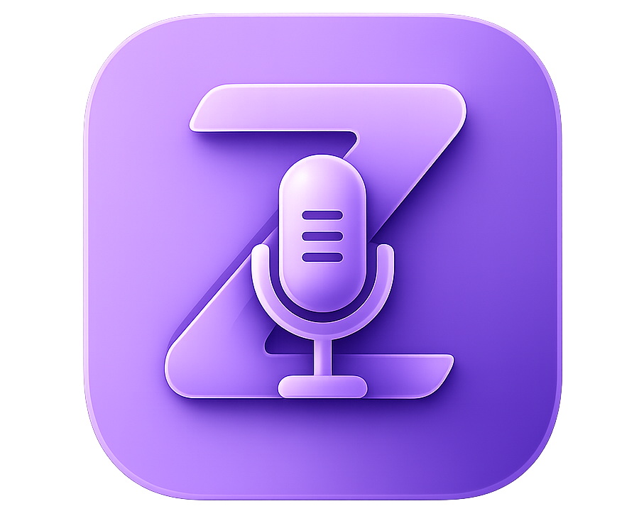

<h1 align="center"></h1>
<p align="center">Text-to-speech flotante para Zen Browser. Elegí el motor que quieras.</p>
<p align="center">
    <a href="https://github.com/JoVi-Yashi/zenTTs/blob/main/LICENSE"></a>
    <a href="https://github.com/JoVi-Yashi/zenTTs"></a>
    
</p>

Un panel TTS que se inyecta en cualquier página con Shadow DOM. Extrae el texto, lo lee con **SpeechSynthesis nativo** o con **edge-tts** (45 voces neurales de Microsoft), y resalta cada oración en tiempo real. Incluye una **app de escritorio** para gestionar el servidor sin tocar la terminal.

Diseñado para lectores de Wattpad, AO3 y FanFiction. Construido sobre la [Web Speech API](https://developer.mozilla.org/en-US/docs/Web/API/Web_Speech_API).

> [!WARNING]
> La extensión se carga como complemento temporal en `about:debugging`. No está publicada en addons.mozilla.org.

---

## Modos de funcionamiento

| Modo | Motor | Cómo activar |
|---|---|---|
| **Nativo** | SpeechSynthesis del navegador | Panel → ⚙ → Motor: Nativo |
| **Neural** | edge-tts · 45 voces Microsoft | `ruby server.rb` + Panel → ⚙ → Motor: Neural |

Cambiás de modo con un click desde el panel de ajustes. La extensión detecta si el servidor está corriendo. Si elegís Neural sin servidor, te avisa.

---

## App de escritorio

TTS-zen incluye una app visual con GTK3 para gestionar el servidor. **Cero terminal.**

<p align="center"><i>Ventana oscura con header bar nativa. Indicador verde/rojo, botones Iniciar/Detener, y acceso directo a Zen Browser.</i></p>

```bash
make gui              # Linux
ruby gui.rb           # Linux / Windows
```

La app muestra estado en tiempo real (polling cada 3s), inicia y detiene el servidor, y abre Zen Browser automáticamente. Se integra con el menú de apps y el dock.

---

## Instalación

### Linux — Flatpak (recomendado)

```bash
git clone https://github.com/JoVi-Yashi/zenTTs.git
cd zenTTs
make flatpak
```

Un solo comando. Ruby, edge-tts, trafilatura, GTK3 — todo incluido. Buscá **TTS-zen** en el menú de apps.

### Linux — Manual

```bash
git clone https://github.com/JoVi-Yashi/zenTTs.git
cd zenTTs
make install                                    # gem install sinatra puma rackup gtk3
cd extension && npm install && cd ..
make build-extension
make install-desktop                            # ícono en el menú
```

### Windows

```bash
# Requisitos: RubyInstaller + MSYS2
gem install sinatra puma rackup gtk3
pip install edge-tts trafilatura

git clone https://github.com/JoVi-Yashi/zenTTs.git
cd zenTTs
cd extension && npm install && cd ..
make build-extension
```

> **Nota**: En Windows, edge-tts y trafilatura deben estar en el PATH. La app usa `netstat`/`taskkill` en vez de `fuser`.

### Cargar la extensión en Zen

1. `about:debugging` → **Cargar complemento temporal**
2. Seleccioná `extension/manifest.json`

---

## Características

### Panel flotante
Shadow DOM encapsulado. El CSS del sitio jamás interfiere. Aparece abajo a la derecha, colapsable a un círculo de 44px.

### Dos motores TTS
Elegí entre SpeechSynthesis nativo (sin dependencias) o edge-tts con voces neurales de Microsoft. Cambiás desde ⚙ → Motor sin reiniciar.

### Highlighting sincronizado
Cada oración se resalta en el DOM del sitio (outline violeta + scroll) y en un pop-up sincronizado con tipografía ajustable.

### Extractores por plataforma
Wattpad, AO3, FanFiction y Webnovel tienen extractores optimizados con selectores específicos. Ignoran headers, navs y sidebars.

### Site Manager
Activá o desactivá la herramienta por dominio con toggle switches. Favicons reales. Persiste entre sesiones.

### App de escritorio
GUI nativa con GTK3. Compatible Linux y Windows. Tema oscuro, header bar del sistema, estado en tiempo real.

---

## Estructura

```
zenTTs/
├── extension/              # Firefox MV3 WebExtension
│   ├── manifest.json
│   ├── content.js          # Bundle esbuild
│   ├── background.js       # Proxy edge-tts
│   ├── src/content.js      # Inyección, extractores, TTS
│   ├── src/panel.js        # UI del panel, settings, sitios
│   └── icons/
├── server.rb               # API REST Ruby/Sinatra
├── gui.rb                  # App de escritorio GTK3
├── launcher.rb             # TUI terminal (alternativa)
├── flatpak/                # Manifest Flatpak + metainfo
├── docs/                   # Landing page
└── Gemfile
```

---

## Tech Stack

| Capa | Stack |
|---|---|
| Extensión | vanilla JS, esbuild IIFE, MV3, Shadow DOM |
| TTS nativo | SpeechSynthesis API |
| TTS neural | edge-tts 7.2.8 + Sinatra (Ruby) |
| Extracción | @mozilla/readability + selectores por sitio |
| GUI | GTK3 + Ruby (Linux / Windows) |
| Packaging | Flatpak, instalación manual, Windows |

---

## Licencia

MIT
