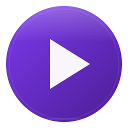

<h1 align="center"></h1>
<p align="center">Text-to-speech flotante para Zen Browser. Leé cualquier página web con un solo click.</p>
<p align="center">
    <a href="https://github.com/JoVi-Yashi/zenTTs/blob/main/LICENSE"></a>
    <a href="https://github.com/JoVi-Yashi/zenTTs"></a>
</p>

Un panel TTS que se inyecta en cualquier página con Shadow DOM. Extrae el texto, lo lee con **SpeechSynthesis nativo** o con **edge-tts** (45 voces neurales de Microsoft), y resalta cada oración en tiempo real — en el sitio y en un pop-up sincronizado. Elegís el motor desde el panel de ajustes.

Diseñado para lectores de Wattpad, AO3 y FanFiction: extractores nativos por plataforma que ignoran headers, navs y sidebars. Solo el contenido de la historia.

Construido sobre la [Web Speech API](https://developer.mozilla.org/en-US/docs/Web/API/Web_Speech_API). Inspirado por Edge Read Aloud.

> [!WARNING]
> Esta extensión se carga como complemento temporal en `about:debugging`. No está publicada en addons.mozilla.org.

## Modos de funcionamiento

| Modo | Motor | Dependencias | Cómo activar |
|---|---|---|---|
| Nativo | SpeechSynthesis | **Ninguna** | Panel ⚙ → Motor: Nativo |
| Neural | edge-tts (45 voces Microsoft) | Ruby + edge-tts CLI | Panel ⚙ → Motor: Neural + `ruby server.rb` |

**La extensión detecta automáticamente** si el servidor está corriendo. Cambiá de modo desde el panel de ajustes (⚙) sin reiniciar nada. Si elegís Neural y el servidor no está disponible, te avisa y podés volver a Nativo con un click.

Para usar el modo Neural, levantá el servidor:
```bash
gem install sinatra puma rackup --user-install
make backend        # o ruby server.rb
```

Y la TUI para gestionarlo:
```bash
ruby launcher.rb    # Iniciar, detener, ver estado del servidor
```

## Características

### Panel flotante

Shadow DOM encapsulado. El CSS del sitio jamás interfiere con la herramienta. Aparece abajo a la derecha con un botón amarillo estilo Mac para colapsarlo a un círculo flotante de 44px.

### Highlighting sincronizado

Cada oración se resalta directamente en el DOM del sitio — outline violeta + scroll automático. Al mismo tiempo, un pop-up muestra el texto completo con subrayado en la oración actual. Ambos se actualizan en tiempo real mientras el audio avanza.

<details><summary><b>Atajos del panel</b></summary>

| Botón | Acción |
|---|---|
| ▶ Leer | Extrae texto y empieza a reproducir |
| ⏸ | Pausa / reanudar |
| ⏹ | Detener |
| ◀ ▶ | Oración anterior / siguiente |
| ● | Minimizar a círculo flotante |
| 👁 | Abrir pop-up de texto extraído |
| 🌐 | Gestionar sitios (activar/desactivar) |
| ⚙ | Voz, velocidad |

</details>

### Site Manager

Activá o desactivá la herramienta por dominio. Cada sitio muestra su favicon real. Los sitios personalizados se persisten entre sesiones. Si desactivás un dominio, el panel desaparece de inmediato.

### Extractores nativos

Cada plataforma tiene su propio extractor optimizado con selectores específicos. Ignoran headers, navegación, sidebars y comentarios.

| Sitio | Selector |
|---|---|
| Wattpad | `.panel.panel-reading:not(.text-center) pre p[data-p-id]` |
| AO3 | `#chapters .userstuff` |
| FanFiction | `.storytext, #storytext` |
| Webnovel | `.cha-content, .chapter-content, .read-content` |
| Genérico | Readability.js → `<main>` → `<article>` → `body.innerText` |

### Preview tipográfico

El pop-up de texto extraído permite cambiar tipografía (Serif / Sans / Mono), tamaño (A− / A+) y espaciado. Todo se aplica en vivo.

### TTS

SpeechSynthesis nativo del navegador. El texto se divide en oraciones y se reproducen secuencialmente. Cada `SpeechSynthesisUtterance` dispara el highlight de la oración correspondiente.

Velocidad ajustable de 0.5x a 3.0x. La voz se selecciona entre las disponibles en el sistema, agrupadas por idioma.

## Instalación

### Flatpak (recomendado — cualquier distro)

```bash
# Clonar y buildear el Flatpak
git clone https://github.com/JoVi-Yashi/zenTTs.git
cd zenTTs
make flatpak
```

Esto instala TTS-zen como aplicación del sistema con ícono en el menú. Incluye Ruby, edge-tts, trafilatura y todas las dependencias. Cero configuración.

Para ejecutar: buscá "TTS-zen" en el menú de apps o `make flatpak-run`.

### Instalación manual

#### Requisitos

- [Zen Browser](https://zen-browser.app/) (Firefox-based)
- Ruby ≥ 3.2
- Node.js ≥ 18
- edge-tts CLI (`pip install edge-tts`)
- trafilatura CLI (`pip install trafilatura`)

#### Clonar y buildear

```bash
git clone https://github.com/JoVi-Yashi/zenTTs.git
cd zenTTs
make install         # gems de Ruby
cd extension && npm install && cd ..
make build-extension
```

#### Cargar en Zen

1. Abrí Zen → `about:debugging` → **Cargar complemento temporal**
2. Seleccioná `extension/manifest.json`

> [!NOTE]
> Si Zen está instalado vía Flatpak, necesita acceso al filesystem:
> ```bash
> flatpak override --user --filesystem=$HOME/Proyectos/zenTTs app.zen_browser.zen
> ```

#### Integración con el escritorio

```bash
make install-desktop   # agrega TTS-zen al menú de aplicaciones
```

### Server opcional (edge-tts)

```bash
gem install sinatra puma rackup --user-install
make backend        # o ruby server.rb
./launcher.rb       # TUI interactiva (ruby launcher.rb)
```

## Estructura

```
zenTTs/
├── extension/              # Firefox MV3 WebExtension
│   ├── manifest.json
│   ├── content.js          # Bundle esbuild (content script)
│   ├── background.js       # Event Page proxy (solo edge-tts)
│   ├── src/
│   │   ├── content.js      # Fuente: inyección, extractores, TTS
│   │   └── panel.js        # Fuente: UI del panel, modales
│   └── icons/              # PNG 16→128 + SVG
├── server.rb               # API REST Ruby/Sinatra (edge-tts)
├── launcher.rb              # TUI interactiva Ruby
├── launcher.sh              # TUI interactiva Bash (alternativa)
├── docs/                   # GitHub Pages landing
├── Makefile
└── Gemfile                 # Dependencias Ruby
```

## Tech Stack

- **Extensión**: vanilla JS, esbuild IIFE, Firefox MV3, Shadow DOM
- **TTS**: SpeechSynthesis API (nativo) / edge-tts 7.2.8 + Sinatra (Ruby)
- **Extracción**: @mozilla/readability v0.6.0 + selectores específicos por sitio
- **Server**: Ruby 3.4, Sinatra, trafilatura CLI, edge-tts CLI

## Licencia

MIT
