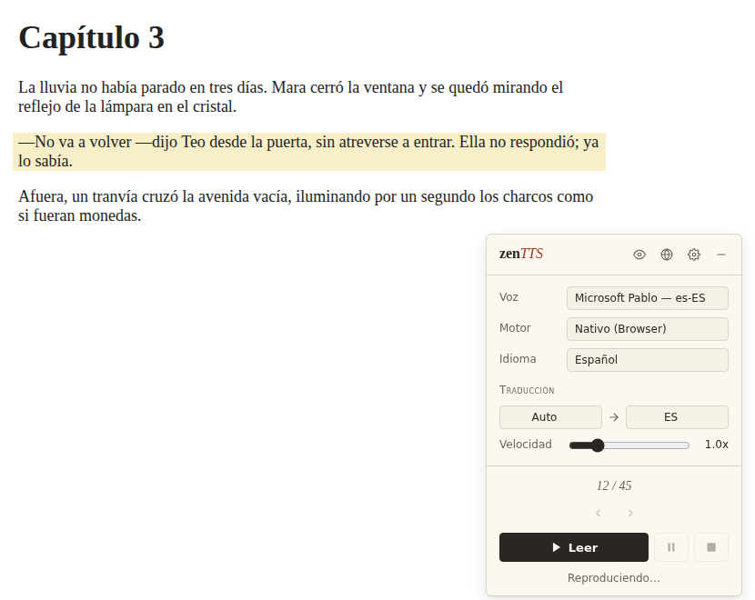

<h1 align="center"></h1>
<p align="center">Text-to-speech flotante para Zen Browser. Elige el motor que quieras.</p>
<p align="center">
    <a href="README.md">Español</a> · <a href="README.en.md">English</a>
</p>

Un panel TTS que se inyecta en cualquier página con Shadow DOM. Extrae el texto, lo lee con **SpeechSynthesis nativo** o con **edge-tts** (45 voces neurales de Microsoft), y resalta cada oración en tiempo real. Incluye una **app de escritorio** para gestionar el servidor sin tocar la terminal.

Diseñado para lectores de Wattpad, AO3 y FanFiction. Construido sobre la [Web Speech API](https://developer.mozilla.org/en-US/docs/Web/API/Web_Speech_API).

> [!WARNING]
> La extensión se carga como complemento temporal en `about:debugging`. No está publicada en addons.mozilla.org.

<p align="center"></p>

---

## Modos de funcionamiento

| Modo | Motor | Cómo activar |
|---|---|---|
| **Nativo** | SpeechSynthesis del navegador | Panel → ⚙ → Motor: Nativo |
| **Neural** | edge-tts · voces neurales de Microsoft | `ruby server.rb` + Panel → ⚙ → Motor: Neural |
| **Local** | Piper en el navegador (WASM), sin conexión | Panel → ⚙ → Voz → Motor: Local → Descargar voz (~60 MB, una vez; ~110 MB las de alta calidad) |

Si el motor Neural falla a mitad de lectura (edge-tts depende de un servicio de Microsoft que a veces no responde), zenTTS sigue desde la misma oración con la voz Local si tienes una descargada, o con la del navegador, y te lo indica en el panel.

---

## App de escritorio

zenTTS incluye una app visual con GTK3 para gestionar el servidor.

<p align="center"><i>Ventana oscura con header bar nativa. Indicador verde/rojo, botones Iniciar/Detener, y acceso directo a Zen Browser.</i></p>

```bash
make gui              # Linux
ruby gui.rb           # Linux / Windows
```

La app muestra estado en tiempo real (polling cada 3s), inicia y detiene el servidor, y abre Zen Browser automáticamente. Se integra con el menú de apps y el dock.

---

## Instalación

### Linux — Flatpak (recomendado)

```bash
git clone https://github.com/JoVi-Yashi/zenTTs.git
cd zenTTs
make flatpak
```

Un solo comando. Ruby, edge-tts, trafilatura, GTK3 — todo incluido. Busca **zenTTS** en el menú de apps.

### Linux — Manual

```bash
git clone https://github.com/JoVi-Yashi/zenTTs.git
cd zenTTs
make install                                    # gem install sinatra puma rackup gtk3
cd extension && npm install && cd ..
make build-extension
make install-desktop                            # ícono en el menú
```

### Windows

```bash
# Requisitos: RubyInstaller + MSYS2
gem install sinatra puma rackup gtk3
pip install edge-tts trafilatura

git clone https://github.com/JoVi-Yashi/zenTTs.git
cd zenTTs
cd extension && npm install && cd ..
make build-extension
```

> **Nota**: En Windows, edge-tts y trafilatura deben estar en el PATH. La app usa `netstat`/`taskkill` en vez de `fuser`.

### Cargar la extensión en Zen

1. `about:debugging` → **Cargar complemento temporal**
2. Selecciona `extension/manifest.json`

---

## Características

### Panel flotante
Shadow DOM encapsulado. El CSS del sitio jamás interfiere. Aparece abajo a la derecha, colapsable a un círculo de 44px.

### Dos motores TTS
Elige entre SpeechSynthesis nativo (sin dependencias) o edge-tts con voces neurales de Microsoft. Cambias desde ⚙ → Motor sin reiniciar.

### Highlighting sincronizado
La oración que suena se marca en la propia página y la palabra que se pronuncia se resalta encima, en tiempo real (tiempos reales con la voz neural, estimados con la local). El marcador fija su propio color de texto, así que se lee igual en sitios claros u oscuros. También se sincroniza con la vista de lectura del panel.

### Extractores por plataforma
Wattpad, AO3, FanFiction y Webnovel tienen extractores optimizados con selectores específicos. Ignoran headers, navs, resúmenes y comentarios.

### Siguiente capítulo automático
En AO3, FanFiction.net y Wattpad, al terminar un capítulo se carga el siguiente en la misma página y la lectura sigue sola. Se desactiva en ⚙ → "Seguir con el siguiente capítulo".

### Idioma detectado y traducción sin conexión
zenTTS detecta el idioma del capítulo con el detector de Firefox. Si no coincide con el idioma en el que quieres escuchar (⚙ → "Leer en": automático, un idioma concreto o el original), te ofrece descargar un paquete de traducción de Firefox Translations (unos 25 MB por dirección). Después traduce en tu equipo, sin conexión. Los pares sin modelo directo pasan por el inglés. También puedes leer en el idioma original o, con el servidor en marcha, traducir en línea.

La lectura empieza en cuanto están traducidos los primeros párrafos; el resto se traduce mientras escuchas. La frase traducida aparece en una tarjeta bajo el párrafo original, con la palabra que suena marcada (⚙ → Lectura → "Mostrar la traducción junto al texto").

En ⚙ → Traducir eliges cómo traducir siempre (preguntar, paquete sin conexión, en línea o no traducir), ves las elecciones recordadas por idioma y puedes olvidarlas, y gestionas los paquetes descargados.

### Empezar donde tú elijas
Pulsa el botón de la mira en el panel y haz clic en la frase por la que quieres empezar; al pasar el ratón se marca la frase. Sin pulsar el botón, los clics en la página no hacen nada. Esc cancela.

### Burbuja movible
Minimizado, zenTTS es una burbuja que puedes arrastrar a cualquier esquina; se queda ahí y el panel se abre en esa misma esquina, orientado hacia ella: en una esquina inferior la barra con los botones queda abajo, y el botón de minimizar siempre está en el lado de la esquina, con la flecha apuntando a ella.

### Voces
Las voces se ofrecen en el idioma en que se va a leer (el traducido, si traduces). Las voces Local (Piper) están agrupadas por calidad: alta (~110 MB), normal (~60 MB) y ligera; en español hay voces de España, México y Argentina. Los ajustes están en cuatro pestañas: Voz, Lectura, Traducir y Aspecto.

Con el motor del navegador, Pausa detiene la voz aunque el sintetizador del sistema (speech-dispatcher en Linux) ignore la pausa; al continuar, retoma desde la última palabra.

### Colores del navegador
El panel sigue el modo claro u oscuro y, si tienes instalado un tema de Firefox, toma sus colores. Zen no deja que las extensiones lean su color de acento, así que en ⚙ → Aspecto puedes elegir uno o pegar el valor de `zen.theme.accent-color` (en `about:config`) para que coincida.

### Continuar donde lo dejaste
zenTTS recuerda la oración por la que ibas en cada capítulo. Al volver, el botón dice **Continuar · 34 / 120**; "Desde el inicio" empieza de nuevo.

### Site Manager
Activa o desactiva la herramienta por dominio con toggle switches. Favicons reales. Persiste entre sesiones.

### App de escritorio
GUI nativa con GTK3. Compatible Linux y Windows. Tema oscuro cálido, header bar del sistema, estado en tiempo real.

---

## Estructura

```
zenTTs/
├── extension/              # Firefox MV3 WebExtension
│   ├── manifest.json
│   ├── content.js          # Bundle esbuild (generado)
│   ├── background.js       # Bundle esbuild (generado)
│   ├── vendor/             # WASM de Piper/onnxruntime (lo copia el build)
│   ├── src/content.js      # Inyección, resaltado, capítulo siguiente
│   ├── src/sites.js        # Extractores por sitio
│   ├── src/player.js       # Reproductor y respaldo entre motores
│   ├── src/engines/        # Nativo, Neural (edge-tts), Local (Piper)
│   ├── src/progress.js     # Recordar la posición por capítulo
│   ├── src/background.js   # Proxy al servidor + Piper
│   ├── src/panel.js        # UI del panel, settings, sitios
│   └── icons/
├── server.rb               # API REST Ruby/Sinatra
├── gui.rb                  # App de escritorio GTK3
├── launcher.rb             # TUI terminal (alternativa)
├── flatpak/                # Manifest Flatpak + metainfo
├── docs/                   # Landing page
└── Gemfile
```

---

## Tech Stack

| Capa | Stack |
|---|---|
| Extensión | vanilla JS, esbuild IIFE, MV3, Shadow DOM |
| TTS nativo | SpeechSynthesis API |
| TTS neural | edge-tts 7.2.8 + Sinatra (Ruby) |
| Extracción | @mozilla/readability + selectores por sitio |
| GUI | GTK3 + Ruby (Linux / Windows) |
| Packaging | Flatpak, instalación manual, Windows |

---

## Licencia

MIT
